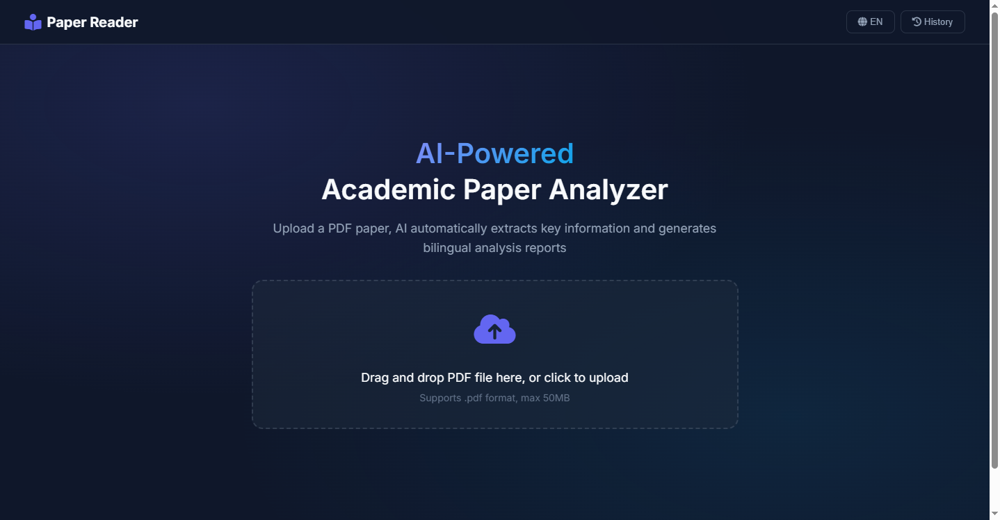

# Paper Reader Agent

<div align="center">
  

  <br />
  
  [](https://www.python.org/downloads/)
  [](MinerU/LICENSE.md)
  [](https://www.deepseek.com/)
  [](https://openai.com/)

  **Hierarchical Multi-Agent System for Academic Paper Deep Analysis**
  
  [中文文档](README_zh.md) | English
</div>

<br />

## 📖 Introduction

**Paper Reader Agent** is an advanced AI system designed to read, analyze, and synthesize academic papers with a depth that matches human researchers.

<details>
<summary><b>📸 Click to see Screenshots (UI & Features)</b></summary>

| **Modern Web UI (Bilingual)** | **Real-time Progress Tracking** |
|:---:|:---:|
|  |  |
| *Clean interface with EN/ZH switching* | *Visualize the 5-agent team in action* |

| **Publication-Quality Reports** | **Specialist Deep Dives** |
|:---:|:---:|
|  |  |
| *Auto-embedded figures & formulas* | *Rich details from specific domains* |

</details>
<br>

**Paper Reader Agent** goes beyond simple summarization...

Unlike standard summary tools, it employs a **Hierarchical Multi-Agent Architecture (1+3+1)** to mimic a professional research team:

1. **Architect**: Deconstructs the paper and plans the reading strategy.
2. **Specialist Team**: Parallel experts analyze Context, Math, and Data.
3. **Editor**: Synthesizes a publication-quality report with embedded figures.

> **Key Feature**: The system detects, extracts, and literally *sees* figures, embedding them directly into the analysis where they are discussed, maintaining full visual context.

---

## 🏗️ Architecture

The system operates using a "Divide and Conquer" strategy orchestrated by a central planner.

<div align="center">
  
</div>

---

## ✨ Key Features

### 🧠 Hierarchical Intelligence

- **Architect Agent**: Strategic planning of what to read and where to focus.
- **Context Hunter**: Digs for the "real" motivation and hidden assumptions.
- **Math Specialist**: Derives equations and explains physical intuition behind formulas.
- **Data Auditor**: Critically checks baselines, variance, and experimental fairness.

### 👁️ Visual Understanding

- **Smart Extraction**: Custom PDF parsing pipeline (based on PyMuPDF) that segments text and images.
- **Context Preservation**: Figures are kept with their relevant text.
- **Auto-Embedding**: The AI inserts figures into the report exactly when discussing them.

### 💻 Modern Interaction

- **Web Interface**: Clean, responsive UI with real-time analysis progress.
- **Dual-Mode**:
  - `Simple`: Quick architect + math check.
  - `Hierarchical`: Full 5-agent deep dive.
- **Bilingual**: Generates native-quality English and Chinese reports simultaneously.

---

## 🚀 Quick Start

### Prerequisites

- Python 3.8+
- API Key (DeepSeek or OpenAI)
- (Optional) CUDA GPU for faster layout analysis

### Installation

```bash
git clone https://github.com/GoDiao/Paper-Reader.git
cd Paper-Reader
python -m venv .venv

# macOS / Linux
source .venv/bin/activate
# Windows (PowerShell)
.venv\Scripts\Activate.ps1

pip install -r requirements.txt
```

Optional dependencies:

```bash
# PDF export (Windows needs extra system dependencies; see weasyprint docs)
pip install weasyprint
```

### Configuration

Copy the env template and fill in your keys (do not commit `.env`):

```bash
# macOS / Linux
cp .env.example .env

# Windows (PowerShell)
Copy-Item .env.example .env
```

Minimal `.env` (choose one):

```env
DEEPSEEK_API_KEY=sk-your-key
# OR
OPENAI_API_KEY=sk-your-key
```

Optional settings (web search enrichment + extra providers):

```env
SILICONFLOW_API_KEY=your_siliconflow_api_key_here
ENABLE_WEB_SEARCH=false
GITHUB_TOKEN=your_github_token_here
HUGGINGFACE_TOKEN=your_huggingface_token_here
SERPER_API_KEY=your_serper_api_key_here
```

### Usage

#### 1. Web Interface (Recommended)

Start the server to enjoy the full interactive experience.

```bash
python web_server.py
```

Open **<http://localhost:8000>** in your browser.

> **Note (Simple mode in Web UI)**  
> The `Simple` mode in the web UI is currently a placeholder and returns a brief message. Use `Hierarchical` mode for full reports.

> **Note (Parser Backend in Web Mode)**  
> The web server currently uses the `auto` strategy by default:  
> - If MinerU (`pip install mineru`) is installed, it will try the **MinerU** backend first.  
> - If MinerU is not installed or fails, it will automatically fall back to the **PyMuPDF** backend.

#### 2. Command Line

```bash
# Full hierarchical analysis (Default, auto parser backend)
python main.py paper.pdf

# Force fast PyMuPDF backend
python main.py paper.pdf --parser pymupdf

# Force high-fidelity MinerU backend (requires: pip install mineru)
python main.py paper.pdf --parser mineru

# Save intermediate agent outputs
python main.py paper.pdf --verbose

# Use OpenAI instead of DeepSeek
python main.py paper.pdf --provider openai --model gpt-4o

# Output Chinese only (can reduce cost)
python main.py paper.pdf --language zh
```

### PDF Parsers: PyMuPDF vs MinerU

- **PyMuPDF (Default, Fast)**  
  - No extra dependencies beyond `pymupdf`.  
  - Very fast, good enough for most standard papers.  
  - Enhanced in this project with table extraction, math-region heuristics, and smarter figure detection.

- **MinerU (Optional, High-Fidelity)**  
  - Install via `pip install mineru` (and follow MinerU's own docs for GPU/driver requirements).  
  - Better at preserving complex layouts, multi-column structure, tables, and math-heavy pages.  
  - When used, this project normalizes MinerU's Markdown + images into the same `ParsedDocument` format as PyMuPDF, so downstream agents and UI work identically.

> **Repository Note**  
> This project supports `pip install mineru` as an optional parsing backend; MinerU manages its own model cache (usually under your user/cache directory).  
> This repository also contains the upstream `MinerU/` source tree (licensed under AGPL-3.0). If you want a permissive license for your app code, avoid shipping MinerU source in the same repo.

---

## 📂 Output Structure

The system organizes outputs to keep your research clean:

### Web mode (`python web_server.py`)

```text
outputs/
└── {upload_id}/
    ├── paper_analysis.md
    ├── paper_analysis_zh.md
    ├── images/
    ├── specialists/
    └── figure_index.json

data/
└── reports.json
```

### CLI mode (`python main.py ...`)

```text
output/
└── {pdf_stem}/
    ├── paper_analysis.md
    ├── paper_analysis_zh.md
    ├── images/
    ├── parsed/
    ├── specialists/
    └── figure_index.json
```

---

## 🛠️ Project Structure

```text
paper_reader/
├── agents/                 # 🤖 The Brains
│   ├── hierarchical_orchestrator.py
│   ├── hierarchical_prompts.py
│   └── ...
├── parsers/                # 👁️ The Eyes
│   └── pdf_parser.py       # Custom Layout Analysis
├── generators/             # 📝 The Scribe
│   └── report_generator.py # Report Assembly
├── backend/                # 🔌 API Server
└── frontend/               # 🖥️ Web UI
```

---

## 🚀 Changelog

### v1.6.0 - History, Export & Performance

- **🗂️ Report History**: Persistent report store with browse/search/delete, plus reloadable specialist reports and chat history.
- **📤 One-click Export**: Export reports as Markdown/DOCX, download extracted figures as a ZIP (PDF export supported via optional dependencies).
- **⚡ PDF Parse Cache**: SHA256-based parse caching (parsed content + figures) to significantly speed up repeated analyses.
- **🌐 Web Search Toggle**: UI switch to enable/disable reproduction resource discovery, with GitHub/HuggingFace token support.
- **🤝 Provider Expansion**: Added SiliconFlow provider support in the web UI with concurrency tuning to reduce rate-limit errors.
- **🈯 Output Language Control**: Choose EN or ZH output to reduce cost and avoid empty report tabs.

### v1.5.0 - UI Modernization & Resource Discovery

- **🎨 Modern UI Overhaul**: Complete redesign with a new Zinc-based dark theme, high-contrast tables for better readability, and refined typography.
- **🔍 Resource Discovery Services**: Integrated automated search for reproduction resources (GitHub code repositories, HuggingFace models/datasets) directly into the analysis pipeline.
- **📋 Reproduction Checklist**: New dedicated section to extract and verify hardware requirements, hyperparameters, and datasets.
- **📉 Variable Tracking**: Added support for tracking mathematical variables and their definitions across the paper.
- **⚡ UX Refinements**: Streamlined the agent progress view by removing the redundant Architect tab, focusing on the specialist analysis.

### v1.3.0 - MinerU Parsing Upgrade

- **🧠 MinerU Parser Backend**: Integrated MinerU (Magic-PDF 2.x pipeline) as a high-fidelity PDF parser for complex academic papers, with better layout, table, and math structure preservation.
- **⚙️ Switchable PDF Backend**: Added a selectable parser backend in CLI (`--parser auto|pymupdf|mineru`) and web mode, so you can choose fast PyMuPDF, high-quality MinerU, or an `auto` strategy that tries MinerU first and falls back to PyMuPDF if unavailable or failing.
- **📂 Unified Output Pipeline**: Normalized MinerU outputs into the existing `ParsedDocument` + figure index flow so that downstream LLM agents, report generation, and UI work seamlessly regardless of which parser backend you choose.

### v1.2.0 - Architecture & Performance Improvements

- **🔧 Unified LLM Client Factory**: Centralized LLM configuration, retry/backoff, and timeout handling across all agents. Added optional global concurrency limiting to prevent API rate limits.
- **📊 Fine-grained Progress Events**: Real-time progress updates for each agent (Architect, Context Hunter, Math Specialist, Data Auditor, Editors) with detailed status messages during LLM calls and retries.
- **⚡ Concurrency Optimization**: Eliminated nested thread pools, unified executor management, and improved resource utilization for better performance under concurrent loads.
- **📄 Enhanced PDF Parser**: Improved PyMuPDF implementation with table extraction (Markdown format), mathematical formula region detection, better text structure preservation, and smarter image caption detection (searches above/below images).
- **🔧 Configuration**: New environment variables (`LLM_TIMEOUT_S`, `LLM_MAX_RETRIES`, `LLM_MAX_CONCURRENCY`) for fine-tuning API behavior.
- **📡 Real-time Streaming**: Implemented streaming responses for expert agents (Math, Data, Context), allowing users to see reports generating token-by-token.
- **📐 Math Formula Fix**: Solved critical rendering issues for streamed LaTeX formulas by protecting delimiters (`\[...\]`, `\(...\)`) from Markdown processing.
- **🏗️ Architect Report**: Added a new dedicated "Architect" tab to visualize the reading plan and agent assignments immediately after the planning phase.
- **🖥️ UI UX Improvements**: Moved Specialist Reports to the main view for better visibility and added auto-focus logic to follow the active agent.

### v1.1.0 - Premium UI & Chat Upgrade

- **✨ New UI**: Introduced a "Deep Space" glassmorphism theme for a premium reading experience.
- **🤖 Smart Chat**: Added context summarization to the Chat AI, allowing for longer, more coherent discussions about the paper.
- **📊 Specialist Reports**: View detailed analysis from specific agents (Context Hunter, Math Specialist, Data Auditor) in dedicated tabs.
- **🌐 Bilingual**: Added full English/Chinese language switching.
- **🐛 Fixes**: Resolved table rendering issues and improved chat interface scrolling.

## 🤝 Contributing

Contributions are welcome! Whether it's a new specialist agent, better parsing logic, or UI improvements.

1. Fork the Project
2. Create your Feature Branch
3. Commit your Changes
4. Push to the Branch
5. Open a Pull Request

## 📄 License

This repository includes `MinerU/` (AGPL-3.0), so redistribution must follow AGPL-3.0. See [LICENSE.md](MinerU/LICENSE.md).

---

<div align="center">
  <b>Star ⭐ this repo if it helped your research!</b>
</div>
