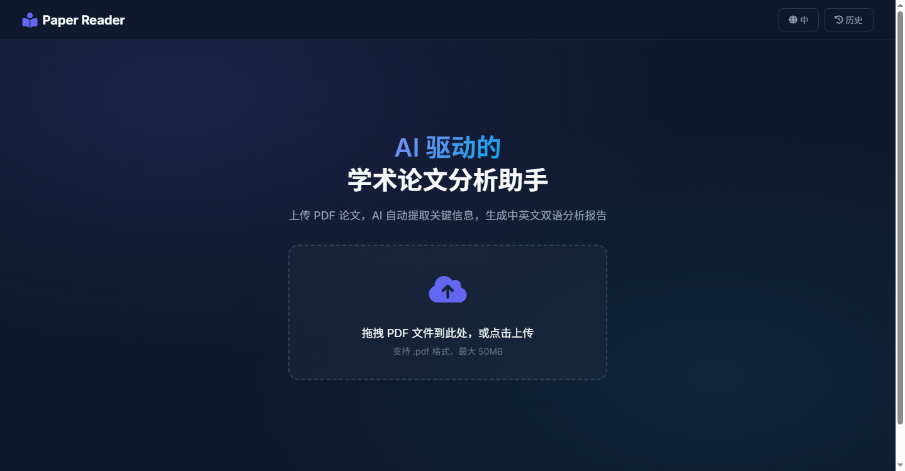
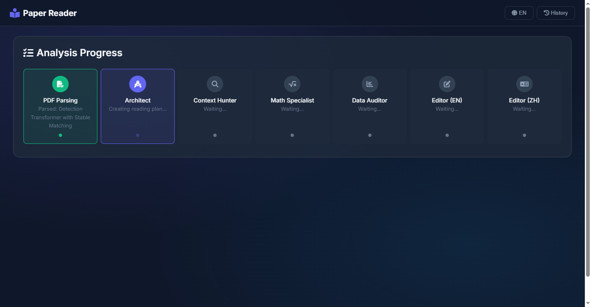
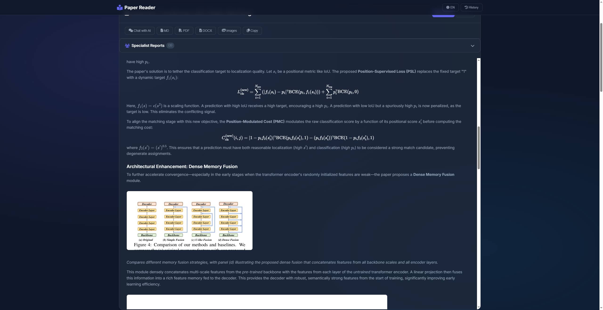
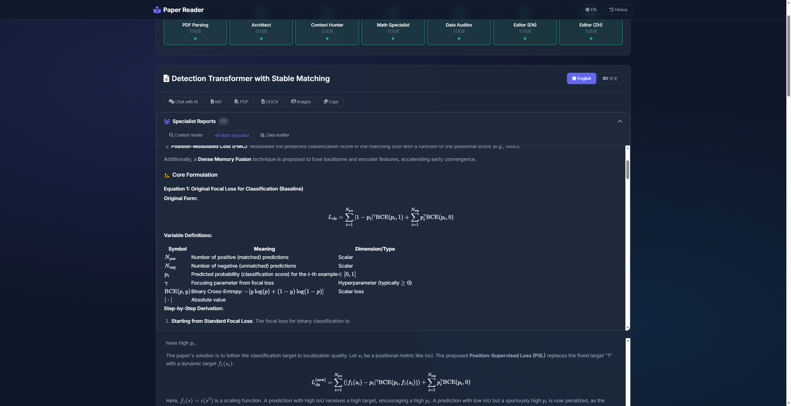
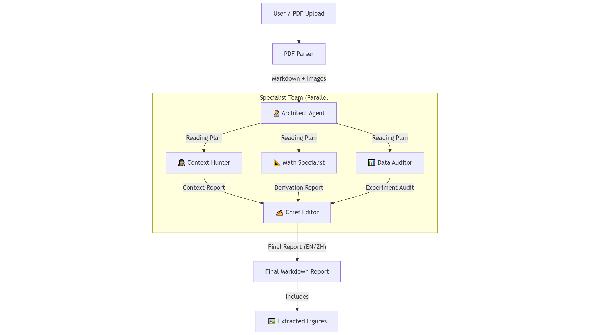

# Paper Reader Agent

<div align="center">
  

  <br />
  
  [](https://www.python.org/downloads/)
  [](MinerU/LICENSE.md)
  [](https://www.deepseek.com/)
  [](https://openai.com/)

  **基于层级化多 Agent 架构的学术论文深度解析系统**
  
  [English](README.md) | 中文文档
</div>

<br />

## 📖 简介

**Paper Reader Agent** 是一个先进的 AI 系统，旨在像人类研究员一样深度阅读、分析并综合学术论文。

<details>
<summary><b>📸 点击查看功能截图 (Showcase)</b></summary>

| **现代化双语 Web 界面** | **实时 Agent 协作进度** |
|:---:|:---:|
|  |  |
| *支持中英文一键切换* | *可视化 1+3+1 Agent 团队工作流* |

| **出版级分析报告** | **专家深度分析 (新功能)** |
|:---:|:---:|
|  |  |
| *自动嵌入公式与插图* | *查看特定领域的深度洞察* |

</details>
<br>

**Paper Reader Agent** 与普通的摘要工具不同...

与普通的摘要工具不同，它采用 **层级化多 Agent 架构 (1+3+1)** 来模拟专业的研究团队：

1. **架构师 (Architect)**：解构论文并规划阅读策略。
2. **专家团队 (Specialist Team)**：并行专家分别分析背景、数学推导和数据实验。
3. **主编 (Editor)**：综合生成出版级质量的报告，并自动嵌入相关图表。

> **核心特性**：系统能够检测、提取并真正“看见”论文中的插图，将其直接嵌入到分析报告的相关讨论中，保留完整的视觉上下文。

---

## 🏗️ 架构设计

系统采用由中心规划者编排的“分而治之”策略。

<div align="center">
  
</div>

---

## ✨ 核心功能

### 🧠 层级化智能

- **架构师 (Architect)**：战略性规划阅读重点和方向。
- **背景猎人 (Context Hunter)**：挖掘“真正”的研究动机和隐含假设。
- **数学专家 (Math Specialist)**：推导公式并解释数学背后的物理直觉。
- **数据审计员 (Data Auditor)**：批判性审查基线、方差和实验公平性。

### 👁️ 视觉理解

- **智能提取**：基于 PyMuPDF 的自定义 PDF 解析管线，精确分割文本和图像。
- **上下文保留**：图片与其相关文本保持关联。
- **自动嵌入**：AI 会在讨论具体内容时自动将图片插入到报告中。

### 💻 现代化交互

- **Web 界面**：简洁响应式的 UI，支持实时分析进度展示。
- **双模式**：
  - `Simple`：快速架构师 + 数学检查。
  - `Hierarchical`：全功能 5-Agent 深度分析。
- **双语支持**：同时生成原生质量的中文和英文报告。

---

## 🚀 快速开始

### 环境要求

- Python 3.8+
- API 密钥 (DeepSeek 或 OpenAI)
- (可选) CUDA GPU 用于加速布局分析

### 安装

```bash
git clone https://github.com/GoDiao/Paper-Reader.git
cd Paper-Reader
python -m venv .venv

# macOS / Linux
source .venv/bin/activate
# Windows (PowerShell)
.venv\Scripts\Activate.ps1

pip install -r requirements.txt
```

可选依赖：

```bash
# PDF 导出（Windows 需要额外系统依赖，见 weasyprint 官方文档）
pip install weasyprint
```

### 配置

复制环境变量模板并填写密钥（不要把 `.env` 提交到仓库）：

```bash
# macOS / Linux
cp .env.example .env

# Windows (PowerShell)
Copy-Item .env.example .env
```

`.env` 最小配置（任选其一）：

```env
DEEPSEEK_API_KEY=sk-your-key
# 或
OPENAI_API_KEY=sk-your-key
```

可选配置（Web 端“复现资源发现 / 网络搜索”与更多 Provider）：

```env
SILICONFLOW_API_KEY=your_siliconflow_api_key_here
ENABLE_WEB_SEARCH=false
GITHUB_TOKEN=your_github_token_here
HUGGINGFACE_TOKEN=your_huggingface_token_here
SERPER_API_KEY=your_serper_api_key_here
```

### 使用方法

#### 1. Web 界面 (推荐)

启动服务器以获得完整的交互体验。

```bash
python web_server.py
```

在浏览器中打开 **<http://localhost:8000>**。

> **说明（Web 的 Simple 模式）**  
> Web UI 的 `Simple` 模式当前为占位实现，会返回提示文本；建议使用 `Hierarchical` 模式获得完整分析报告。
 
> **说明（Web 模式下的解析后端）**  
> Web 服务当前默认使用 `auto` 策略：  
> - 如果本地已安装 MinerU（`pip install mineru`），会优先尝试 **MinerU** 解析。  
> - 如果 MinerU 未安装或解析失败，则自动回退到 **PyMuPDF** 后端。

#### 2. 命令行 (CLI)

```bash
# 全层级深度分析（默认，自动选择解析后端）
python main.py paper.pdf

# 强制使用快速的 PyMuPDF 解析后端
python main.py paper.pdf --parser pymupdf

# 强制使用高保真的 MinerU 解析后端（需要先安装：pip install mineru）
python main.py paper.pdf --parser mineru

# 保存所有 Agent 的中间输出
python main.py paper.pdf --verbose

# 使用 OpenAI 替代 DeepSeek
python main.py paper.pdf --provider openai --model gpt-4o

# 仅输出中文报告（可减少开销）
python main.py paper.pdf --language zh
```

### PDF 解析器：PyMuPDF vs MinerU

- **PyMuPDF（默认，速度快）**  
  - 只依赖 `pymupdf`，无需额外安装大型模型。  
  - 解析速度快，对大部分普通论文已经足够。  
  - 在本项目中进行了增强：支持表格提取、数学区域启发式识别、更智能的图像检测与标题匹配。

- **MinerU（可选，高保真）**  
  - 通过 `pip install mineru` 安装（并按 MinerU 官方文档配置 GPU / 驱动等环境）。  
  - 更擅长保留复杂版式、多栏结构、表格以及公式密集的页面。  
  - 本项目会将 MinerU 产出的 Markdown + 图片规范化为统一的 `ParsedDocument` 结构，下游 Agent 和前端 UI 在不同解析后端之间无缝复用。

> **仓库说明**  
> 本项目支持通过 `pip install mineru` 使用 MinerU 解析后端；MinerU 的模型缓存由其自身管理（通常在用户目录/缓存目录下）。  
> 当前仓库同时包含 `MinerU/` 源码（许可证为 AGPL-3.0），如需以更宽松许可证开源你的业务代码，建议不要将 MinerU 源码一并发布到同一仓库。

---

## 📂 输出结构

系统将输出组织得井井有条：

### Web 模式（`python web_server.py`）

```text
outputs/
└── {upload_id}/
    ├── paper_analysis.md       # 英文最终报告（如选择输出）
    ├── paper_analysis_zh.md    # 中文最终报告（如选择输出）
    ├── images/                 # 所有提取的插图
    ├── specialists/            # 中间专家报告
    └── figure_index.json       # 元数据

data/
└── reports.json                # 历史记录索引
```

### CLI 模式（`python main.py ...`）

```text
output/
└── {pdf_stem}/
    ├── paper_analysis.md
    ├── paper_analysis_zh.md
    ├── images/
    ├── parsed/                 # PDF 解析中间产物（markdown/图片等）
    ├── specialists/
    └── figure_index.json
```

---

## 🛠️ 项目结构

```text
paper_reader/
├── agents/                 # 🤖 大脑
│   ├── hierarchical_orchestrator.py
│   ├── hierarchical_prompts.py
│   └── ...
├── parsers/                # 👁️ 眼睛
│   └── pdf_parser.py       # 自定义布局分析
├── generators/             # 📝 记录员
│   └── report_generator.py # 报告组装
├── backend/                # 🔌 API 服务端
└── frontend/               # 🖥️ Web 前端
```

---

## 🚀 更新日志

### v1.6.0 - 历史记录、导出与性能提升

- **🗂️ 历史记录**: 分析报告持久化存储，支持浏览/搜索/删除，并可随时打开旧报告、查看专家报告与聊天记录。
- **📤 一键导出**: 支持导出 Markdown/DOCX，打包下载论文图片（ZIP）（PDF 导出后端已支持，依赖可选）。
- **⚡ 解析缓存**: 基于文件 SHA256 的解析缓存（正文 + 插图），重复分析显著提速。
- **🌐 网络搜索开关**: Web 端提供启用/禁用开关，支持 GitHub/HuggingFace Token，自动补全复现资源。
- **🤝 新增 SiliconFlow**: Web 端新增 SiliconFlow Provider，并对并发做自适应调整以减少 429 等限流错误。
- **🈯 输出语言选择**: 可选择只生成中文或英文报告，减少开销并避免空白 Tab。

### v1.5.0 - UI 现代化与资源发现

- **🎨 UI 视觉升级**: 全新基于 Zinc 色系的深色主题，高对比度表格样式，以及更优的排版体验。
- **🔍 资源发现服务**: 集成 GitHub 代码库和 HuggingFace 模型/数据集的自动搜索功能，辅助论文复现。
- **📋 复现清单 (Reproduction Checklist)**: 新增专门板块，自动提取并核对硬件要求、超参数设置及数据集信息。
- **📉 变量追踪**: 支持追踪论文中的数学符号及其定义。
- **⚡ 交互优化**: 精简了 Agent 进度展示，移除冗余的架构师 (Architect) 栏目，更聚焦于专家分析内容。

### v1.3.0 - MinerU 解析升级

- **🧠 MinerU 解析后端**: 集成 MinerU（Magic-PDF 2.x pipeline）作为高保真 PDF 解析器，更好保留复杂论文的版式结构、表格与数学区域。
- **⚙️ 可切换解析后端**: 支持在命令行通过 `--parser auto|pymupdf|mineru` 以及 Web 模式中选择解析策略，可在更快的 PyMuPDF 与更高质量的 MinerU 之间自由切换，或使用 `auto` 先尝试 MinerU 失败后自动回退到 PyMuPDF。
- **📂 统一输出管线**: 将 MinerU 的输出规整为统一的 `ParsedDocument` + 图像索引格式，下游 LLM Agent、报告生成和前端 UI 在不同解析后端之间无缝复用。

### v1.2.0 - 架构与性能优化

- **🔧 统一 LLM 客户端工厂**: 集中管理所有 Agent 的 LLM 配置、重试/退避和超时处理。新增可选的全局并发限流，防止 API 速率限制。
- **📊 细粒度进度事件**: 为每个 Agent（架构师、背景猎人、数学专家、数据审计员、编辑）提供实时进度更新，在 LLM 调用和重试期间显示详细状态信息。
- **⚡ 并发优化**: 消除嵌套线程池，统一执行器管理，改进资源利用，提升并发负载下的性能。
- **📄 PDF 解析器增强**: 改进的 PyMuPDF 实现，支持表格提取（Markdown 格式）、数学公式区域识别、更好的文本结构保留，以及更智能的图像标题检测（上下搜索）。
- **🔧 配置选项**: 新增环境变量（`LLM_TIMEOUT_S`、`LLM_MAX_RETRIES`、`LLM_MAX_CONCURRENCY`）用于微调 API 行为。
- **📡 实时流式传输**: 为专家 Agent（数学、数据、背景）实现了流式响应，允许用户逐字查看生成过程中的分析报告。
- **📐 数学公式修复**: 解决了流式传输中 LaTeX 公式渲染问题，通过保护定界符（`\[...\]`, `\(...\)`）防止 Markdown 转义错误。
- **🏗️ 架构师报告**: 新增独立的“架构师”标签页，在规划阶段完成后立即展示阅读计划和 Agent 任务分配。
- **🖥️ UI UX 改进**: 将专家报告版块移至主分析视图以提高可见性，并添加了跟随活跃 Agent 的自动聚焦逻辑。

### v1.1.0 - UI 升级与智能对话

- **✨ 全新 UI**: 引入“深空”毛玻璃主题，提供沉浸式阅读体验。
- **🤖 智能对话**: 聊天功能新增上下文总结记忆，支持更长、更连贯的论文探讨。
- **📊 专家报告**: 新增独立标签页展示背景调查、数学分析和数据审计报告。
- **🌐 双语支持**: 完整支持中英文界面一键切换。
- **🐛 问题修复**: 修复了表格渲染问题，优化了聊天界面的滚动交互。

## 🤝 贡献

欢迎提交 PR！无论是新的专家 Agent、更好的解析逻辑，还是 UI 改进。

1. Fork 本项目
2. 创建您的特性分支
3. 提交您的更改
4. 推送到分支
5. 开启 Pull Request

## 📄 许可证

本仓库包含 `MinerU/`（AGPL-3.0），整体分发需遵循 AGPL-3.0。详见 [LICENSE.md](MinerU/LICENSE.md)。

---

<div align="center">
  <b>如果这个项目对您的研究有帮助，请给个 Star ⭐！</b>
</div>
